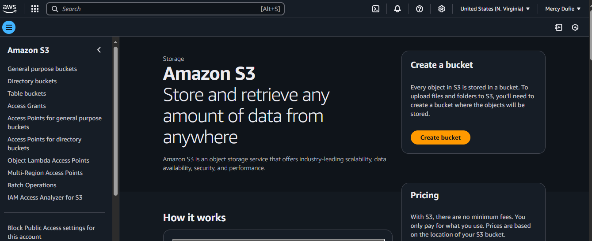
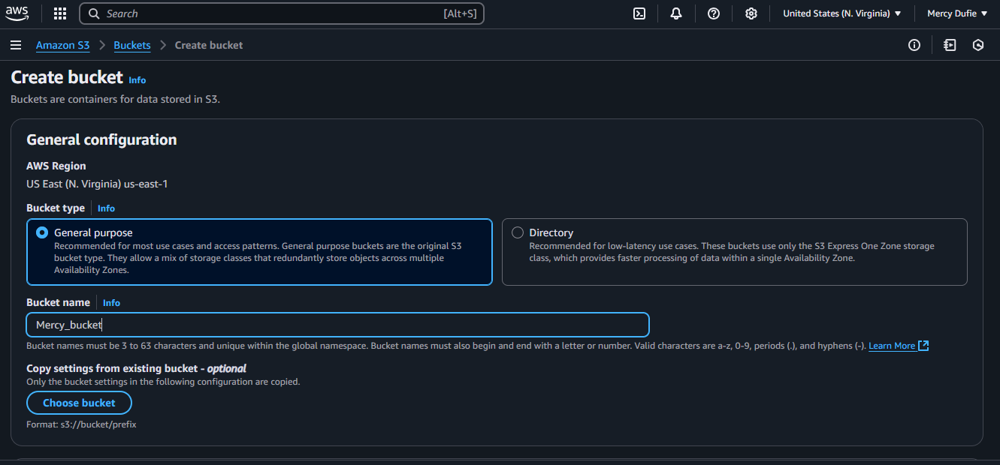
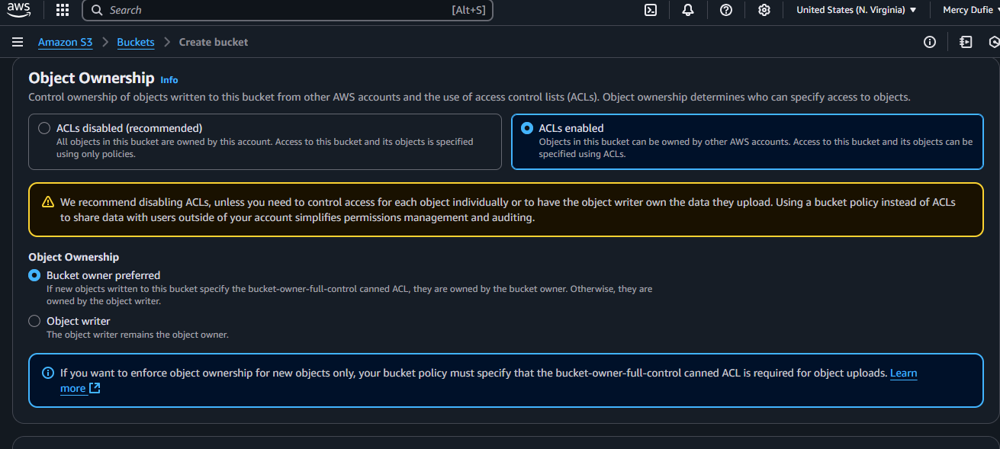
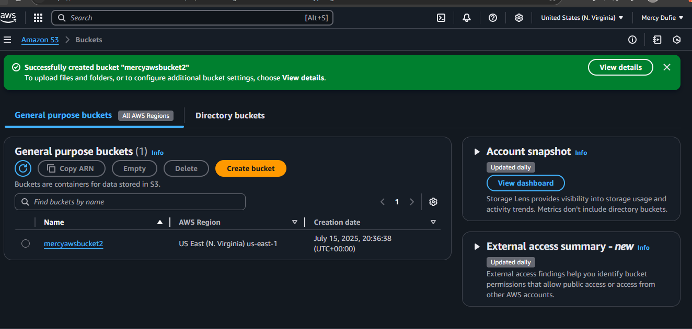

# 🌐 Static Website with S3 Bucket

This project shows how to host a **static personal website** using an Amazon S3 bucket.  
It includes an HTML page with your personal profile, skills, projects, contact info, and images.

---

## 🚀 Project Overview

We use:
- **Amazon S3** for hosting
- **HTML & CSS** for building the website
- Profile and background images for design

---

## 📄 Files in this repo

- `index.html`: Main website file
- `GIAR24-148.jpg`: Your personal photo
- `background.jpg`: Background image for your site
- `error.html` *(optional)*: Custom error page

---

## 💡 Steps to deploy

### 1️⃣ Create S3 bucket

- Go to AWS Console → S3 → Create bucket
- Give it a **unique name**
- **Uncheck "Block all public access"** to make the website public

> 
  
  
  
  

---

### 2️⃣ Upload website files

- Upload `index.html`, `profile.jpg`, `background.jpg`, and any other assets

> 

---

### 3️⃣ Set files to public

- Select all uploaded files → Actions → Make public

> 

---

### 4️⃣ Enable static website hosting

- Go to **Properties** tab → Static website hosting → Enable
- Set:
  - **Index document**: `index.html`
  - **Error document**: `error.html` (optional)

> 

---

### 5️⃣ Add bucket policy

- Go to **Permissions** tab → Bucket Policy → Edit
- Add the following policy (replace `your-bucket-name`):

 

```json
{
  "Version": "2012-10-17",
  "Statement": [
    {
      "Sid": "PublicReadGetObject",
      "Effect": "Allow",
      "Principal": "*",
      "Action": "s3:GetObject",
      "Resource": "arn:aws:s3:::your-bucket-name/*"
    }
  ]
}

### Access your website
-Copy your S3 website endpoint URL
-Open it in your browser to see your live website! 🎉
